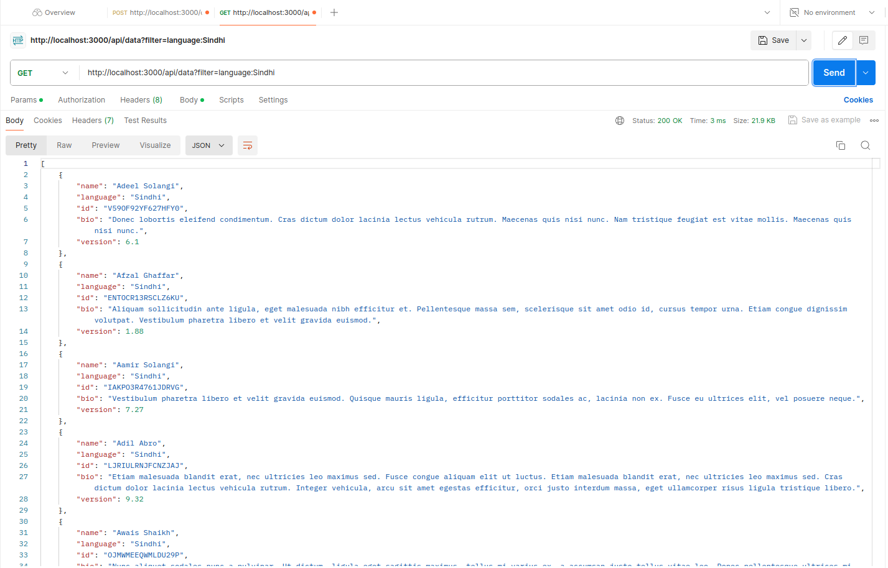

# Dummy Data Server

## Project Overview

This Node.js project sets up a server that fetches and stores dummy JSON data in a MongoDB database. The server provides an API to retrieve this data with options for filtering and sorting.

## Project Setup

### Prerequisites

- Node.js (v18.x or later)
- npm (Node Package Manager)
- MongoDB Atlas Account (for cloud-based MongoDB) or local MongoDB setup

### Installation

1. **Clone the Repository**

   ```bash
   git clone https://github.com/CodeMaverick2/DummyDataServer.git
   cd DummyDataServer
   ```

2. **Install Dependencies**

   ```bash
   npm install express axios dotenv mongodb
   ```

3. **Set Up Environment Variables**

   Create a `.env` file in the root directory with the following content:

   ```plaintext
   API_KEY=<DummyData_Url>
   MONGODB_URI=Your MongoDB URI here
   PORT=3000
   ```

   **Getting Your MongoDB URI:**

   - **MongoDB Atlas:**
     1. Go to the [MongoDB Atlas website](https://www.mongodb.com/cloud/atlas).
     2. Sign up or log in to your account.
     3. Create a new cluster or use an existing one.
     4. Navigate to the "Database Access" section to create a new database user with the appropriate permissions.
     5. Go to the "Network Access" section to allow access from your IP address.
     6. Navigate to the "Connect" section and choose "Connect your application".
     7. Copy the connection string provided and replace `Your MongoDB URI here` in your `.env` file. Make sure to include the credentials and database name as required.


4. **Initialize the database**
    This starts the initalization script that fetches the dummy json data and stores it in MongoDB. This script should run before starting the server one time to populate our database with dummy json data.
   ```bash
   node initialize.js
   ```

5. **Start the Server**

   You have two options to start the server:

   - **Using `npm start`:** 

     This command starts the server using the `node` command. It will not automatically reload the server when files are changed, making it suitable for production.

     ```bash
     npm start
     ```

   - **Using `npx nodemon server.js`:** 

     This command starts the server with `nodemon`, which automatically reloads the server when changes are detected in your code. This is useful during development to see changes without restarting the server manually.

     ```bash
     npx nodemon server.js
     ```

   You can choose either method based on your needs.


## API Endpoints

### 1. Fetch All Data

**Endpoint:** `GET /api/data`

**Description:** Returns all dummy data.

**Example Request:**

```http
GET http://localhost:3000/api/data
```

**Example Response:**

```json
[
    {
        "_id": "66a8aedfa13c60e969f47361",
        "name": "Adeel Solangi",
        "language": "Sindhi",
        "id": "V59OF92YF627HFY0",
        "bio": "Donec lobortis eleifend condimentum. Cras dictum dolor lacinia lectus vehicula rutrum. Maecenas quis nisi nunc. Nam tristique feugiat est vitae mollis. Maecenas quis nisi nunc.",
        "version": 6.1
    },
    ...
]
```

### 2. Filter Data

**Endpoint:** `GET /api/data?filter=<field>:<value>`

**Description:** Filtering is case-insensitive and uses partial matching. Sorting order is default ascending(asc) we can set it to descending(desc).

**Parameters:**

- `filter`: A filter query string in the format `<field>:<value>`

**Example Request:**

```http
GET http://localhost:3000/api/data?filter=language:Sindhi
```

**Example Response:**

```json
[
    {
        "_id": "66a8aedfa13c60e969f47361",
        "name": "Adeel Solangi",
        "language": "Sindhi",
        "id": "V59OF92YF627HFY0",
        "bio": "Donec lobortis eleifend condimentum. Cras dictum dolor lacinia lectus vehicula rutrum. Maecenas quis nisi nunc. Nam tristique feugiat est vitae mollis. Maecenas quis nisi nunc.",
        "version": 6.1
    }
]
```

### 3. Sort Data

**Endpoint:** `GET /api/data?sort=<field>`

**Description:** Returns data sorted by the specified field.

**Parameters:**

- `sort`: The field to sort by.

**Example Request:**

```http
GET http://localhost:3000/api/data?sort=version:asc
```

**Example Response:**

```json
[
    {
        "_id": "66a8aedfa13c60e969f47389",
        "name": "Semet Alim",
        "language": "Uyghur",
        "id": "HI7L2SR4RCS8C8CS",
        "bio": "Duis commodo orci ut dolor iaculis facilisis. Ut viverra quis eros eu tincidunt. Lorem ipsum dolor sit amet, consectetur adipiscing elit.",
        "version": 1.01
    },
    {
        "_id": "66a8aedfa13c60e969f4744e",
        "name": "Semet Alim",
        "language": "Uyghur",
        "id": "HI7L2SR4RCS8C8CS",
        "bio": "Duis commodo orci ut dolor iaculis facilisis. Ut viverra quis eros eu tincidunt. Lorem ipsum dolor sit amet, consectetur adipiscing elit.",
        "version": 1.01
    }
]
```

### 4. Filter and Sort Data

**Endpoint:** `GET /api/data?filter=<field>:<value>&sort=<field>`

**Description:** Returns data filtered and sorted based on the provided parameters.

**Parameters:**

- `filter`: A filter query string in the format `<field>:<value>`
- `sort`: The field to sort by.

**Example Request:**

```http
GET http://localhost:3000/api/data?filter=language:Hindi&sort=version:desc
```

**Example Response:**

```json
[
    {
        "_id": "66a8aedfa13c60e969f473e8",
        "name": "Chetana Hegde",
        "language": "Hindi",
        "id": "J9GS1RODDZL325LK",
        "bio": "Aliquam sollicitudin ante ligula, eget malesuada nibh efficitur et. Nulla finibus massa at viverra facilisis. Nam tristique feugiat est vitae mollis. Phasellus tincidunt sollicitudin posuere.",
        "version": 9.99
    },
    {
        "_id": "66a8aedfa13c60e969f474ad",
        "name": "Chetana Hegde",
        "language": "Hindi",
        "id": "J9GS1RODDZL325LK",
        "bio": "Aliquam sollicitudin ante ligula, eget malesuada nibh efficitur et. Nulla finibus massa at viverra facilisis. Nam tristique feugiat est vitae mollis. Phasellus tincidunt sollicitudin posuere.",
        "version": 9.99
    }
]
```

## Error Handling

- **400 Bad Request:** Returned if the `filter` or `sort` parameters are invalid or incorrectly formatted. For example, if the `filter` parameter does not follow the `field:value` format or if the `sort` field is missing.
- **404 Not Found:** Returned if the requested data or endpoint is not found.
- **500 Internal Server Error:** Returned for unexpected server errors, such as database connectivity issues or errors in data processing.

## Postman Documentation
### 1. Get all data :

```http
GET http://localhost:3000/api/data
```


### 2. Filter Data :

```http
GET http://localhost:3000/api/data?filter=name:Anita%20rajput
```
 **Here instead of spacing we have used %20 this ensures that url's are correctly interpreted in some cases it may work with a spacing as we can see in image below.**




### 3. Sort Data :

```http
GET http://localhost:3000/api/data?sort=version:desc
```
 


### 4. Filter and Sort Data :
In this request the default ordering is ascending for version we can specify if we want but the default is ascending we can alter it to descending
```http
GET http://localhost:3000/api/data?filter=language:Hindi&sort=version
```
 


### 5. Uncompleted Queries


### 6. Invalid type for filtering or sorting


### 7. URL Invalid Queries
    In case of invalid queries error handling is done


### 8. Incomplete Queries
    In case of incomplete qeuries we get error saying respective field is not present in the data


